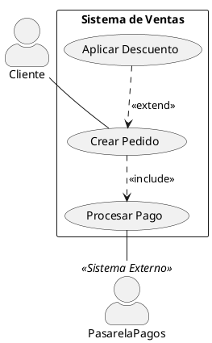

# Skill: Diagrama de Casos de Uso - Pautas de Cátedra (DSI 2026)

Esta skill define las reglas obligatorias y criterios de evaluación de la cátedra de **Diseño de Sistemas (DSI 2026)** para modelar **Diagramas de Casos de Uso** en PlantUML.

---

## 📌 Reglas de Oro de la Cátedra (Checklist de Parcial)

### 1. Actores
- **Lado izquierdo:** Actores primarios que inician los casos de uso.
- **Lado derecho:** Sistemas externos o actores que actúan como soporte o receptores de información (ej. *AFIP*, *Pasarela de Pagos*) sin iniciar el CU.
- **Roles, nunca nombres propios:** Usar siempre nombres de roles o cargos (ej. *Cajero*, *Cliente*, *Administrador*; **nunca** *Juan Pérez*).
- **Prohibido conectar actores entre sí con líneas simples:** Entre actores únicamente puede haber relaciones de **Generalización / Herencia** (flecha triangular hueca `--|>`).

### 2. Casos de Uso (Óvalos)
- **Nomenclatura estricta:** Siempre nombrado como `[Verbo en infinitivo] + [Sustantivo]` (ej. *Registrar Pedido*, *Consultar Catálogo*).
- **Sin descomposición funcional:** No crear casos de uso para pasos individuales de una pantalla (ej. está **prohibido** crear *Validar Contraseña* o *Buscar Producto* como CUs aislados).
- **Sin casos de uso huérfanos:** Todo caso de uso debe estar conectado directa o indirectamente (vía include/extend) a un actor.

### 3. Asociaciones Actor - Caso de Uso
- **Línea sólida simple:** Conecta al actor con el óvalo del caso de uso.
- **¡REGLA DE CÁTEDRA: NO LLEVA FLECHAS!**
  - En PlantUML escribir `--` (ej: `Cliente -- CU_Pedido`).
  - **No usar `-->` ni `<--`**.

### 4. Límite del Sistema (System Boundary)
- Rectángulo contenedor con el nombre del sistema arriba (`rectangle "Nombre del Sistema" { ... }`).
- **Regla estricta:** Los casos de uso van adentro; los actores van **siempre afuera**.

### 5. Relaciones entre Casos de Uso

| Relación | Cuándo se usa | Sentido de la flecha en PlantUML |
| :--- | :--- | :--- |
| `<<include>>` | Comportamiento obligatorio o común indispensable para completar el CU base. | `CU_Base ..> CU_Incluido : <<include>>` *(flecha apunta al incluido)* |
| `<<extend>>` | Comportamiento opcional o condicional bajo un punto de extensión. | `CU_Extension ..> CU_Base : <<extend>>` *(flecha apunta a la base)* |
| **Generalización** | Un actor o CU hereda comportamiento de otro más general. | `Subclase --|> Superclase` *(flecha triangular hueca hacia el padre)* |

---

## 🛠️ Estructura PlantUML Recomendada



---

## 🚀 Verificación
Al generar o editar un diagrama `.puml`, renderizarlo a SVG mediante:
```bash
./render.sh casos-de-uso/
```
