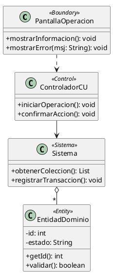

# Skill: Diagrama de Clases (Realización de CU) - Pautas de Cátedra (DSI 2026)

Esta skill establece las reglas y criterios de evaluación de la cátedra de **Diseño de Sistemas (DSI 2026)** para modelar el **Diagrama de Clases de la Realización del Caso de Uso**.

---

## 📌 Reglas de Oro de la Cátedra (Checklist de Parcial)

### 1. Alcance Restringido al Caso de Uso
- Se grafican **únicamente** las clases que participan activamente en el caso de uso analizado.
- Clases que deben estar presentes:
  1. Clase de Interfaz (`UI`)
  2. Clase Controladora (`CTRL` y `CTRLSesion`)
  3. Clase del Sistema (`Sistema`)
  4. Clases de Dominio necesarias (con atributos y métodos de negocio)

### 2. REGLA CRÍTICA: UI y Controladores NO llevan atributos
> **"Importante: Las clases UI y Controlador no llevan atributos."** *(Apunte Parcial Práctico 2026)*

- **`UI`:** Responsable exclusivo de la interacción con el usuario. **Cero atributos**. Métodos típicos: recibir datos, mostrar información, mostrar confirmaciones o alertas de error.
- **`CTRL`:** Coordina la ejecución del caso de uso. **Cero atributos**. Métodos típicos: iniciar acción del CU, recibir eventos de UI, coordinar el flujo, despachar mensajes al Sistema o Dominio.
- **`CTRLSesion`:** Provee credenciales y contexto del usuario activo. **Cero atributos**.
- **`Sistema`:** Mantiene/conoce las colecciones globales, busca instancias, realiza altas de objetos y cálculos globales.
- **Clases de Dominio:** Entidades del negocio (*Cliente*, *Pedido*, *Producto*). **Sí contienen atributos** (visibilidad privada `-`) y métodos (`+`).

### 3. Asignación de Métodos (Las 5 Preguntas Clave)
1. ¿Es una interacción directa con el actor? $\rightarrow$ **UI**
2. ¿Es coordinación del flujo y pasos del CU? $\rightarrow$ **CTRL**
3. ¿Necesita buscar en una colección global, registrar un alta o calcular a nivel general? $\rightarrow$ **Sistema**
4. ¿Es información o validación propia de un objeto concreto? $\rightarrow$ **Clase de Dominio**
5. **Regla de Coherencia Bidireccional:** Todo mensaje que llegue a una línea de vida en el Diagrama de Secuencia **debe figurar como método en esa clase en el Diagrama de Clases**.

### 4. Relaciones y Notaciones
- **Herencia / Generalización (`<|--`):** Línea sólida con triángulo hueco hacia el padre.
- **Composición (`*--`):** Rombo relleno en el "todo" (ciclo de vida fuertemente ligado).
- **Agregación (`o--`):** Rombo hueco en el contenedor (ej: colecciones en `Sistema`).
- **Asociación simple (`--`):** Relación estructural con multiplicidades (`1`, `*`, `0..1`).
- **Dependencia (`..>`):** Línea punteada con flecha (ej. UI invocando al CTRL).
- *(Nota de cátedra: clases DTO y alcance estático no se evalúan en la práctica).*

---

## 🛠️ Estructura PlantUML Recomendada



---

## 🚀 Verificación
Al generar o editar diagramas de clases:
```bash
./render.sh clases/
```
